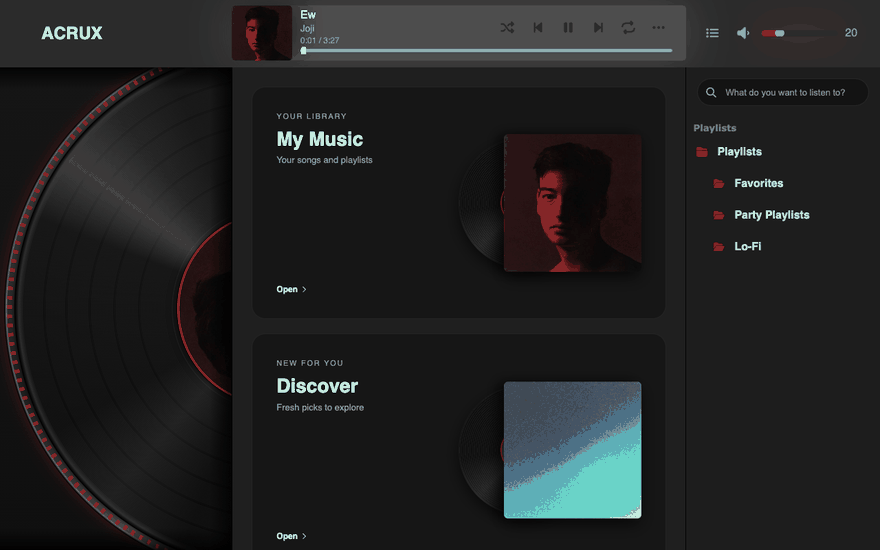
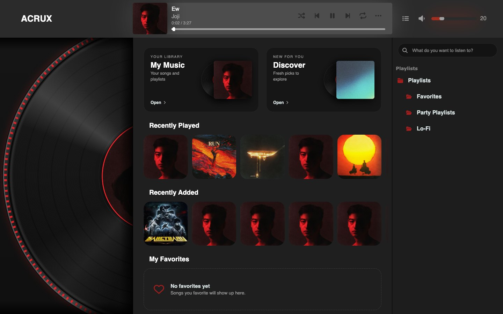
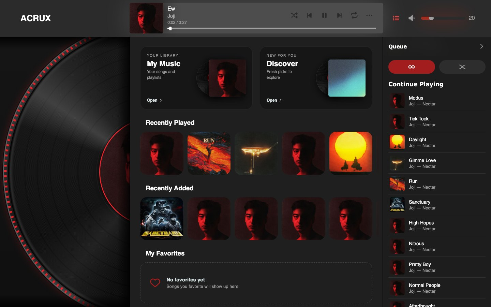
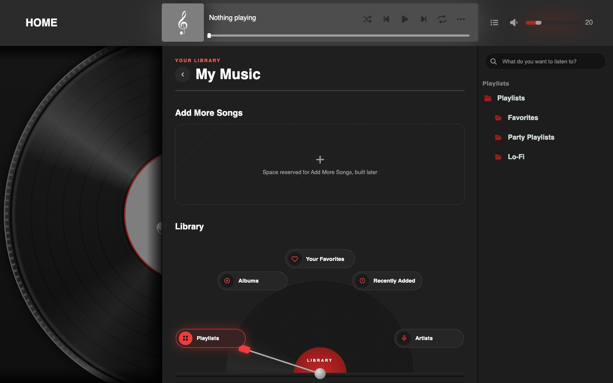
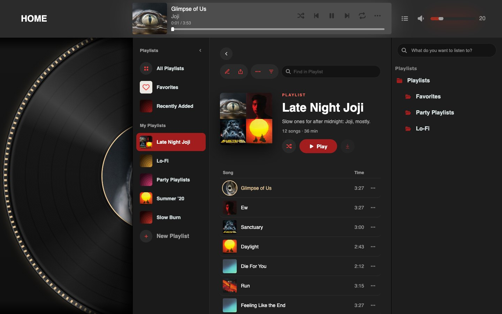
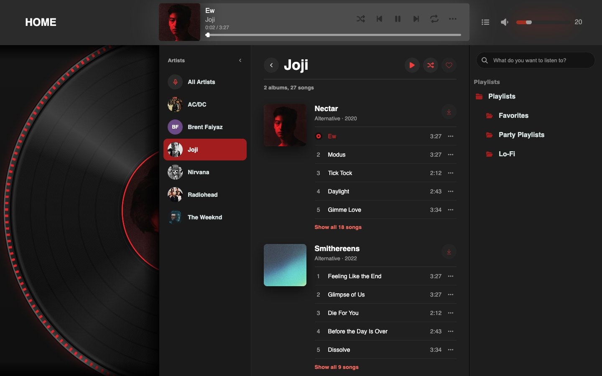
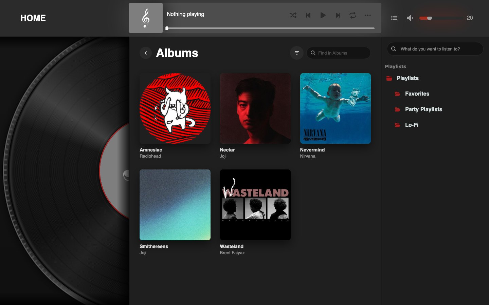
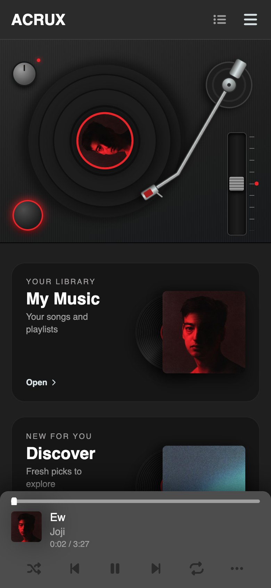

<p align="center">
  
</p>

<p align="center">
  <a href="https://ashesbloom.github.io/music-webpage/"><b>▶ Live demo</b></a>
  &nbsp;·&nbsp; <a href="#run-it-locally">Run it locally</a>
  &nbsp;·&nbsp; <a href="#under-the-hood">Under the hood</a>
</p>

<p align="center">
  
  
  
  
</p>

**ACRUX** is a music streaming site built around a vinyl record. The record is the player, not an ornament. It spins
with a small motor model and can be grabbed to scratch or seek. The whole interface picks up its colour from the
album that's playing. You can move through the library, the queue and the search, and the music never stops.

<p align="center">
  
</p>

## What makes it different

| | |
|---|---|
| 💿 **The record is the player** | A turntable with a tonearm and strobe dots. The record spins up and slows down with the music, and dragging it scratches or seeks like real vinyl. All of it runs on a custom Web Audio deck. |
| 🎨 **Colour follows the cover** | The dominant colour of each cover tints the record, the label ring, the glow and the sleeves. |
| 🔁 **Music never stops** | Links swap only the middle column and side panel, so audio, the record and the queue keep going. Back and Forward still work. |
| 📜 **A real queue** | *Continue Playing* sits below and *History* is a scroll up. Turn on *Infinite* to keep the music going. With shuffle on, the queue shows the actual shuffled order. |
| 🎛️ **The Library dial** | *My Music* opens on a half-record dial of Playlists, Albums, Favorites, Recently Added and Artists, with a tonearm pointer. |
| 📦 **A crate of playlists** | Playlists lean in a crate like sleeves. Hover one and its record slides out. Covers are photos, mosaics or generated groove art. |
| 🔴 **Now playing is a record too** | The playing row's thumbnail turns into a tiny spinning record. Click it again to pause. |
| 🗂️ **Split views that fold** | The Playlists and Artist pages have a side list that folds to icons by itself when the column gets narrow. It can also be folded by hand. |
| 🔎 **Search that lands** | A song opened from search scrolls into place in its album, and the row briefly lights up. Recent searches keep up with the catalog. |
| 📱 **Phone layout** | The deck moves to the top, a player sits at the bottom, and the dial becomes a row of chips. |

## Screens

<table>
  <tr>
    <td width="50%"><br><sub><b>Home</b>: the record column, banners, Recently Played</sub></td>
    <td width="50%"><br><sub><b>Queue</b>: Continue Playing, Infinite and History</sub></td>
  </tr>
  <tr>
    <td><br><sub><b>My Music</b>: the Library dial and the playlist crate</sub></td>
    <td><br><sub><b>Playlist</b>: sort, find, the ⋯ menu and the spinning now-playing row</sub></td>
  </tr>
  <tr>
    <td><br><sub><b>Artist</b>: the split view, with the albums and their tracks</sub></td>
    <td><br><sub><b>Albums</b>: a record slides out of each cover on hover</sub></td>
  </tr>
</table>

<p align="center"></p>

## Run it locally

```sh
git clone https://github.com/ashesbloom/music-webpage.git
cd music-webpage
node server.js          # http://localhost:3000  (PORT=8080 node server.js to change it)
```

There's nothing to install and nothing to build. `server.js` is a tiny static server with byte ranges and no
dependencies. The site needs **http**, because the audio engine loads an AudioWorklet and fetches the songs, and a
browser won't allow either from `file://`. Any static host works, GitHub Pages included.

## Under the hood

Plain HTML, CSS and JavaScript. There's no framework, no bundler and no packages. The browser does the heavy lifting:

- **Audio:** `DeckAudio` ([deck-audio.js](javascript/deck-audio.js)) is a Web Audio engine that stands in for `<audio>`.
  An AudioWorklet does variable-rate playback, which makes scratching possible. The next song is
  preloaded so it starts at once.
- **Routing:** [nav.js](javascript/nav.js) fetches the next page and swaps in only its content, using `pushState`
  and `popstate`. The player is never unloaded.
- **Data:** [catalog.js](javascript/catalog.js) is the single source for songs, albums, artists and playlists. The
  library pages ([library.js](javascript/library.js)) are drawn from it.
- **Modern CSS in place of JS:** native `popover` menus, `<dialog closedby="any">`, `:has()`, container queries (the
  folding lists), CSS nesting, and `cos()`/`sin()` to place the dial items. The icons are CSS masks.

```
index.html · library.html        pages (the library views are ?view=playlist|album|albums|artist)
javascript/
  catalog.js                     every song, album, artist, playlist
  deck-audio.js (+ worklet)      the audio engine
  player.js · queue.js · more.js playback, queue, ⋯ tray
  turntable.js · seekbar.js      the record and the progress bar
  library.js · search.js · nav.js  library views, search, in-page navigation
style/insert.css                 all of the styling
playback_tree/                   covers, songs, video tiles
tests/                           paste-into-console checks (queue, library, navigation)
```

## Roadmap

- [x] Responsive layout, the turntable deck, and scratching
- [x] Queue with Infinite and Shuffle, History, and the ⋯ tray
- [x] Library: My Music, playlists, albums, artists
- [x] Playback that carries on across pages
- [ ] Accounts and storage: saving playlists and favorites, and uploads through *Add More Songs*
- [ ] Auto Mix crossfades
- [ ] FLAC streaming

## Credits

The demo tracks and artwork belong to their artists and labels, including Joji, Radiohead, Nirvana and AC/DC. They
are here only to show the interface.

<p align="center"><sub>ACRUX™</sub></p>
