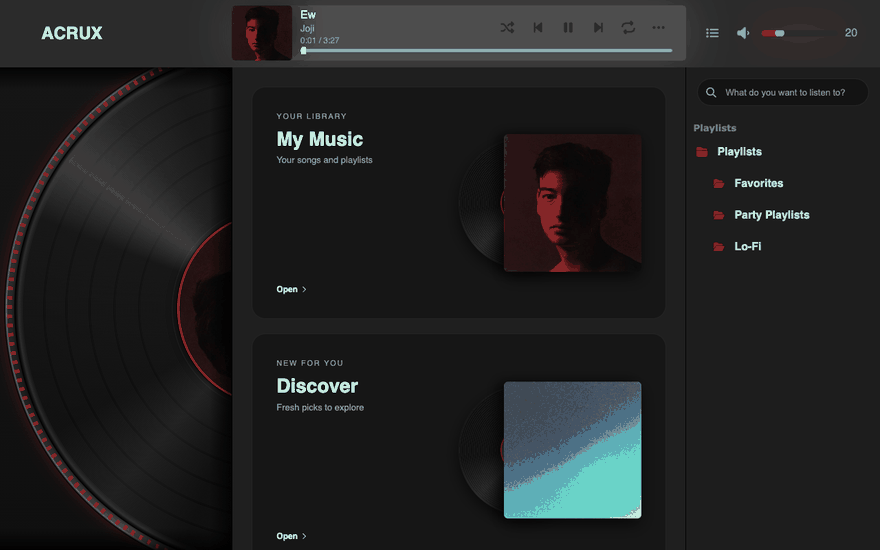
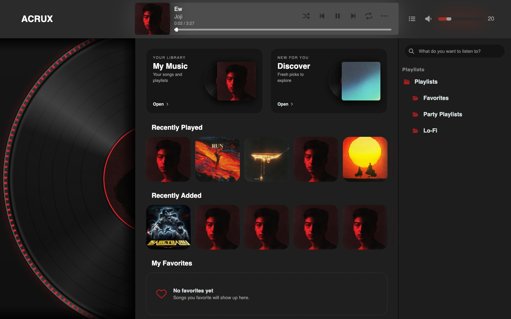
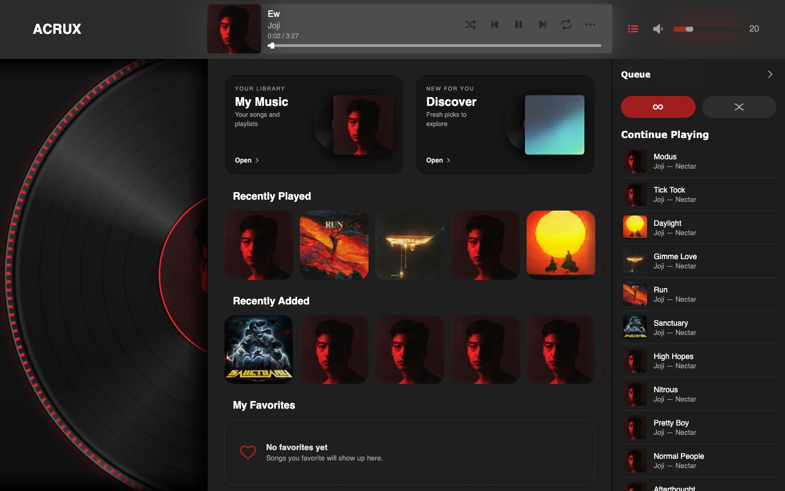
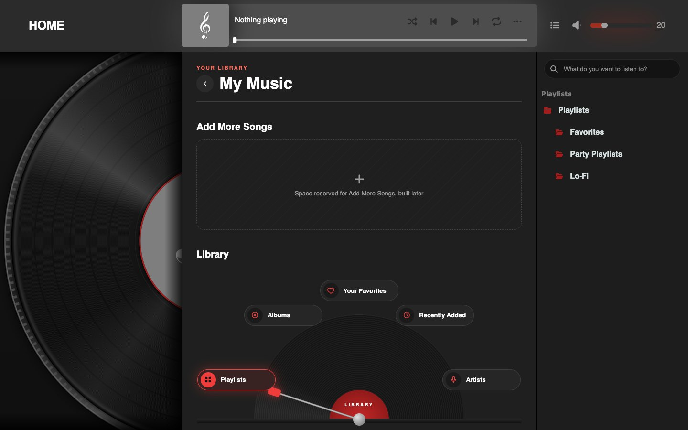
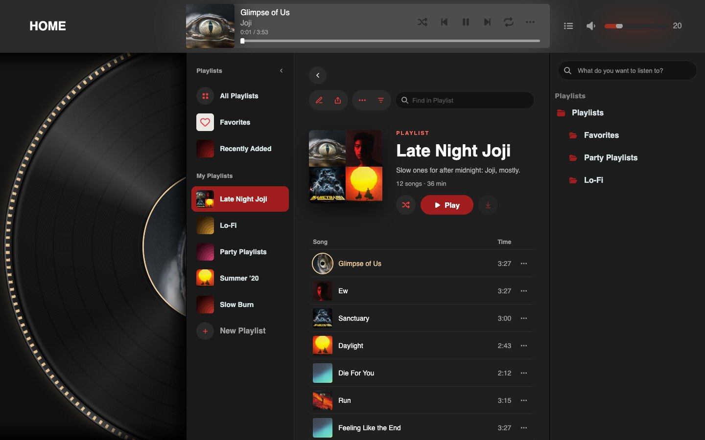
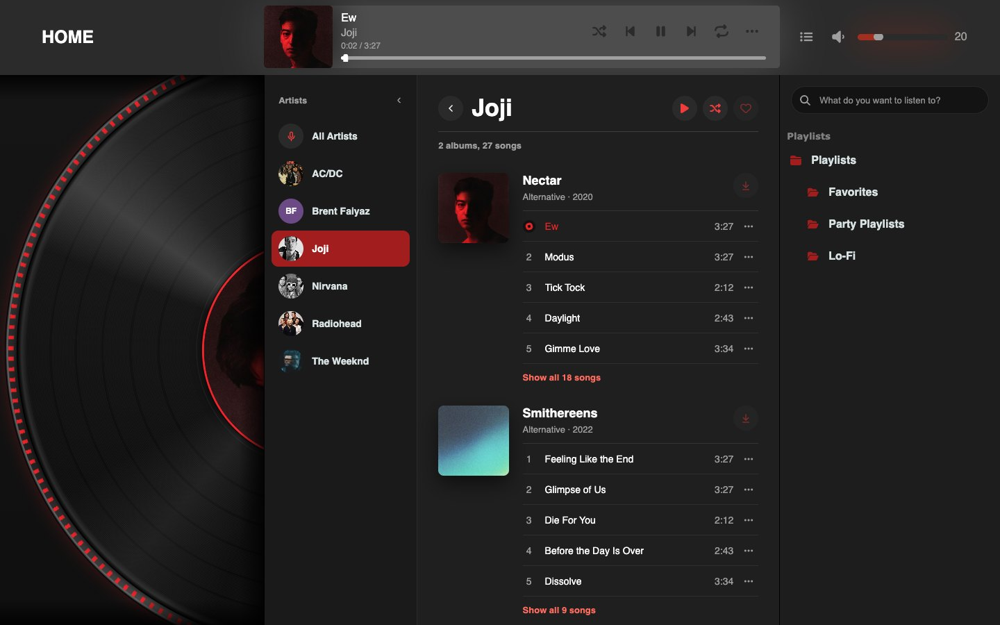
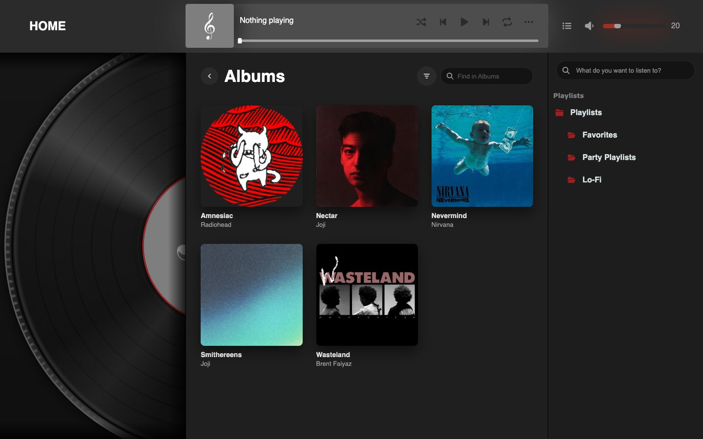
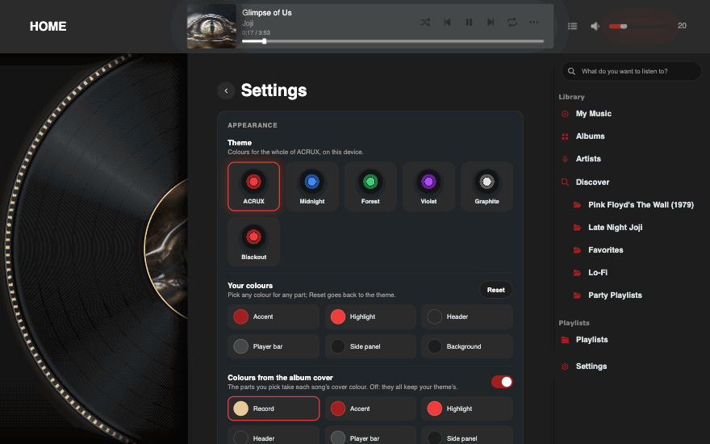
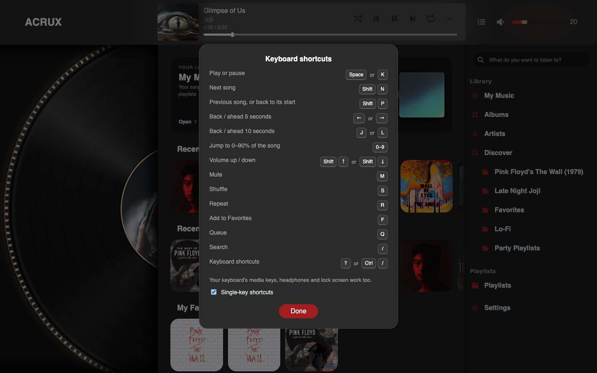
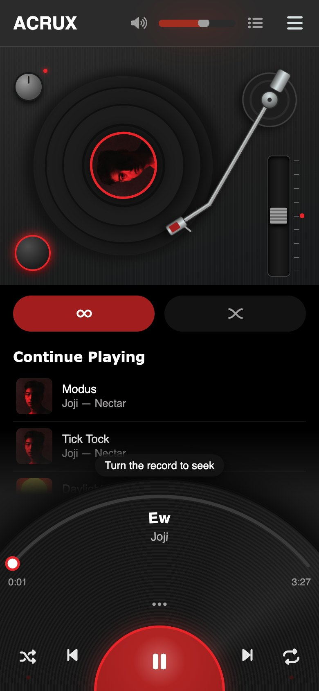

<p align="center">
  
</p>

<p align="center">
  <a href="https://ashesbloom.github.io/music-webpage/"><b>▶ Live demo</b></a>
  &nbsp;·&nbsp; <a href="#run-it-locally">Run it locally</a>
  &nbsp;·&nbsp; <a href="#under-the-hood">Under the hood</a>
</p>

<p align="center">
  
  
  
  
</p>

**ACRUX** is a music streaming site built around a vinyl record. The record is the player, not an ornament. It spins
with a small motor model and can be grabbed to scratch or seek. The whole interface picks up its colour from the
album that's playing. You can move through the library, the queue and the search, and the music never stops.

<p align="center">
  
</p>

## What makes it different

| | |
|---|---|
| 💿 **The record is the player** | A turntable with a tonearm and strobe dots. The record spins up and slows down with the music, and dragging it scratches or seeks like real vinyl. All of it runs on a custom Web Audio deck. |
| 🎨 **Colour follows the cover** | The dominant colour of each cover tints the record, the label ring, the glow and the sleeves. In Settings, the accent, the highlight and any panel can follow it too, each on or off. |
| 🔁 **Music never stops** | Links swap only the middle column and side panel, so audio, the record and the queue keep going. Back and Forward still work. |
| 📜 **A real queue** | *Continue Playing* sits below and *History* is a scroll up. Turn on *Infinite* to keep the music going. With shuffle on, the queue shows the actual shuffled order. On a desktop it opens by itself 3 s into a song and closes again 5 s into a pause, unless you opened or used it. The side panel's *Playlists* shows the five you've listened to most lately. |
| 🎛️ **The Library dial** | *My Music* opens on a half-record dial of Playlists, Albums, Favorites, Recently Added and Artists, with a tonearm pointer. |
| 📦 **A crate of playlists** | Playlists lean in a crate like sleeves. Hover one and its record slides out. Covers are photos, mosaics or generated groove art. |
| 🔴 **Now playing is a record too** | The playing row's thumbnail turns into a tiny spinning record. Click it again to pause. |
| 🗂️ **Split views that fold** | The Playlists and Artist pages have a side list that folds to icons by itself when the column gets narrow. It can also be folded by hand. |
| 🔎 **Search that lands** | A song opened from search scrolls into place in its album, and the row briefly lights up. Recent searches keep up with the catalog. |
| 📱 **An iPod on your phone** | On a phone, home is the deck and the queue, over a record rising from the bottom of the screen. Its outer groove is the seek bar and the title curves along it. ⏯ sits on the red label, and you turn the record to seek. Every other page has a mini player that brings you back. |

## Screens

<table>
  <tr>
    <td width="50%"><br><sub><b>Home</b>: the record column, banners, Recently Played</sub></td>
    <td width="50%"><br><sub><b>Queue</b>: Continue Playing, Infinite and History</sub></td>
  </tr>
  <tr>
    <td><br><sub><b>My Music</b>: the Library dial and the playlist crate</sub></td>
    <td><br><sub><b>Playlist</b>: sort, find, the ⋯ menu and the spinning now-playing row</sub></td>
  </tr>
  <tr>
    <td><br><sub><b>Artist</b>: the split view, with the albums and their tracks</sub></td>
    <td><br><sub><b>Albums</b>: a record slides out of each cover on hover</sub></td>
  </tr>
  <tr>
    <td><br><sub><b>Settings</b>: themes, any colour for any part or the album cover's, playback, queue and updates</sub></td>
    <td><br><sub><b>Keyboard shortcuts</b> (press ?): media keys, headphones and the lock screen work too</sub></td>
  </tr>
</table>

<p align="center"></p>

## Install the app

**Mac, with [Homebrew](https://brew.sh)** (it opens with no security prompts):

```sh
brew install --cask ashesbloom/tap/acrux
```

Or download it from the [latest release](https://github.com/ashesbloom/music-webpage/releases/latest):

- **Mac:** `ACRUX-<version>-mac.dmg`, for any Mac (Apple Silicon and Intel: it runs natively on both). Drag ACRUX to
  Applications.
- **Windows:** `ACRUX-<version>-win-x64.exe`, or `-win-arm64.exe` for ARM PCs (Snapdragon, Surface Pro X).
- **Linux:** `.deb` (Ubuntu, Debian, Mint: `sudo apt install ./ACRUX-<version>-linux-amd64.deb`) or `.AppImage`, each
  for x64 and arm64.

The builds aren't signed yet, so the first time you open a download, your computer asks whether you trust it:

- **Mac:** if macOS says *"ACRUX" Not Opened* (Apple could not verify it), press **Done**, not Move to Bin. Then run
  this once in Terminal. It clears the download flag and signs ACRUX for this Mac:

  ```sh
  xattr -cr "/Applications/ACRUX.app" && codesign --force --deep --sign - "/Applications/ACRUX.app"
  ```

  Then open ACRUX as usual. Or: open it once, close the warning, and press **Open Anyway** in System Settings →
  Privacy & Security. (Homebrew does this for you.)
- **Windows:** when SmartScreen says *Windows protected your PC*, press **More info**, then **Run anyway**.

`SHA256SUMS.txt` in each release lists every file's checksum, and `gh attestation verify <file> -R
ashesbloom/music-webpage` checks that GitHub built it from this repository.

The app starts with no music; Set up ACRUX walks you through adding yours. Your library lives in
`~/Library/Application Support/ACRUX` (Mac), `%APPDATA%\ACRUX` (Windows) or `~/.config/ACRUX` (Linux), with
`server.log` beside it if something goes wrong. ACRUX updates itself: it downloads each new version in the background
and asks to restart (**Settings → Updates**). The first time you turn on inviting people in Collaborators, your
firewall asks to let ACRUX use the network: allow it for people on your Wi-Fi to join.

To build it yourself: `npm install`, then `npm run app` to try it, and `npm run dist` for this computer's installer (in
`dist/`). [release.yml](.github/workflows/release.yml) tests every push. Run it by hand (Actions → Release → Run
workflow) to build every installer without publishing. Pushing a `v*` tag builds them and publishes the release, with
`docs/releases/<tag>.md` as its notes, and updates the Homebrew cask ([desktop/acrux.rb](desktop/acrux.rb)).

## Run it locally

```sh
git clone https://github.com/ashesbloom/music-webpage.git
cd music-webpage
npm install             # one package: music-metadata, which reads your songs' tags
node server.js          # http://localhost:3000  (PORT=8080 node server.js to change it)
```

The first time it runs, ACRUX plays a two-second intro and opens **Set up ACRUX**. It asks where your music is (Google
Drive, this computer, online), walks you through getting the Google and Jamendo keys with a check that says what to fix,
and ends with a QR code that connects your phone over your Wi-Fi. Then three short cards show how the record works. To
see it again, use *Set up ACRUX* at the bottom of My Music, or start with an empty data folder:
`ACRUX_DATA=/tmp/acrux-fresh node server.js`.

There's nothing to build. `server.js` serves the site (with byte ranges), your music and the Discover API (Node 22.13+
for its built-in SQLite). The site needs **http**, because the audio engine loads an
AudioWorklet and fetches the songs, and a browser won't allow either from `file://`. The library works on any static
host, GitHub Pages included. **Discover** and **Add More Songs** need `node server.js`.

### Discover: free music online

Discover (the home banner, or *Discover “…” online* at the end of any search) finds songs, albums and artists in
[Jamendo](https://www.jamendo.com), [Audius](https://audius.co) and the [Internet Archive](https://archive.org) (the
Live Music Archive and community uploads, marked as such), with 30-second iTunes previews only for songs none of them
has in full. Its tabs are *All · Songs · Albums · Artists · YouTube*; lists keep loading as you scroll, and albums and
artists open pages laid out like the library's. Songs play on the record at the quality you pick, starting within a
couple of seconds while the rest downloads. On YouTube, an artist's whole catalogue comes from their "Topic" channel
(found through [MusicBrainz](https://musicbrainz.org)) for a few quota units; other searches cost one of about 99 a day.
A YouTube song plays like any other (header, queue, Next), with its video as a screen on the deck in place of the record:
YouTube's rules don't allow the sound without the video, and it pauses when the deck is out of sight.

With no search, Discover opens on **For you**: *Your taste* (your top genres, kinds of song, artists and albums, lately
and all-time) and rows built from it: On repeat, Your recent mix, Because you like…, More from…, Artists like…. The
server learns from how long you actually listen to each song, including YouTube videos (a skip counts against). The home
page's Recently Played, Recently Added, By Artist and By Albums rows follow your listening too. Pictures a source lacks
(artist photos, covers) are found by name on Deezer, iTunes, the Cover Art Archive and Wikimedia Commons. The Archive needs no key. The other two keys can be pasted in Set up ACRUX, or put in a `.env` file next to
`server.js` (it's gitignored; it wins over pasted keys) before starting the server:

```sh
JAMENDO_CLIENT_ID=…   # free, from https://devportal.jamendo.com
YOUTUBE_API_KEY=…     # Google Cloud console, with YouTube Data API v3 enabled
```

A YouTube search costs 101 of the 10,000 daily quota units, about 99 searches a day; an artist's catalogue about 20.
The page shows how many searches are left. Answers are cached in `data/acrux.db` (a day for most sources, a week for
YouTube), so a repeat is instant and free. Your listening history lives there too, and never leaves your machine.

### Add More Songs: your own music

The top of **My Music** takes your music two ways:

- **From this computer:** pick one of the two on the tile (it remembers). Nothing is uploaded anywhere either way.
  Tags, covers (embedded, or a `cover.jpg`/`folder.jpg` next to the songs) and durations are read on the way in, songs
  already there are skipped, and untagged files are named after their file and folder. MP3, FLAC, M4A, OGG, Opus, WAV
  and AIFF.
  - *Keep a copy in ACRUX:* drop songs, folders or a `.zip` on the dashed tile (or choose them). They're copied into
    `data/music/<artist>/<album>/`, and they play from there. An album you added can be removed from its ⋯ menu, and
    its files go with it.
  - *Play from where it is:* choose a folder from the list of this computer's folders. Nothing is copied: its songs
    play from that folder. *Refresh* (and each start of ACRUX) picks up new, changed and removed files; a song whose
    file is gone won't play until then. Removing the folder or one of its albums only takes it out of ACRUX; your files
    stay where they are.
- **From Google Drive:** paste a link to a song, an album, or a folder of albums. ACRUX lists it and every folder
  inside it, and reads each song's tags from the first 64 KB of its file (live progress on the panel). Then it plays
  them through a cache on this computer. A song downloads when you play it and plays while it downloads. The start of
  the next few songs in your queue (and of an album you open) is fetched ahead, so skipping is instant. Every byte is
  fetched once. *Refresh* picks up new, changed and removed files.

Everything you add shows up under **Your added music** as a sleeve: click it to open the album (or a folder's albums),
or press its play button. It's all in Albums, Artists and search too. The bar at the bottom sets how long a Drive song
stays downloaded after you last play it (a week by default) and the cache's size (10 GB; past it, the songs played
longest ago go first).

Drive needs one-time setup in [Google Cloud Console](https://console.cloud.google.com), in the same project as your
YouTube key or a new one:

1. **APIs & Services → Library:** turn on the **Google Drive API**.
2. **Folders shared as "Anyone with the link":** an API key does it. `YOUTUBE_API_KEY` is used if its API restrictions
   include the Drive API (Credentials → the key), or add a separate one:
   ```sh
   GOOGLE_API_KEY=…
   ```
3. **Private folders:** create an OAuth client ID of type **Desktop app** (the OAuth consent screen first: External,
   with you as a test user) and add it, then use *Connect Google Drive* on the panel:
   ```sh
   GOOGLE_CLIENT_ID=…
   GOOGLE_CLIENT_SECRET=…
   ```
   ACRUX asks for read-only access. Your sign-in is kept in the macOS Keychain (elsewhere, a private file in `data/`).
   While the consent screen is in *Testing*, Google signs you out after 7 days. *Publish* it (it stays unverified,
   which is fine for personal use; Google shows a warning screen once) to stay signed in.

Google holds back downloads made with an API key when many come from one computer in a row (you'd see *Google Drive
is holding back downloads*). It passes by itself, usually within the hour, and songs already downloaded keep playing.
Signed-in downloads (*Connect Google Drive*, step 3) aren't held back like this, so set that up if you listen a lot.

Adding music only works from the computer running ACRUX. With `HOST=0.0.0.0`, phones on your Wi-Fi can play it but not
change it.

### Your collection: playlists, favorites, downloads, collaborators

- **Playlists:**
  - Make one with *New Playlist*, or with *Add to Playlist* in any song's ⋯ menu, from any page (Discover songs and
    YouTube videos too).
  - *Edit* changes the name, description and cover (a groove colour or a photo) and whether search finds it.
  - *Order Songs* lets you drag rows, or use the arrows from the keyboard. *Duplicate* makes a copy you can change, and
    *Pin* keeps a playlist at the top everywhere.
  - The demo playlists (Late Night Joji and the rest) play, pin, ♥, download and duplicate, but can't be changed.
- **♥:** songs, albums (the *Only Favorites* filter in Albums), artists and playlists. The songs you ♥ are *Your
  Favorites*.
- **Download:** keeps songs playable without the internet.
  - Drive songs are kept whole in the cache and never trimmed, and Discover songs are saved to `data/offline`.
  - Songs you dropped in, and the built-in ones, are on this computer already. Videos and 30-second previews can't be
    kept.
- **Save to Computer:** gives you the file, or a ZIP for an album or playlist.
- **Collaborators:**
  - *Invite with link* lets people on your Wi-Fi add, remove and reorder songs in one playlist, or only listen.
  - Turning it on makes ACRUX also listen on this computer's Wi-Fi address. Without an invite, the network gets only
    the site's own files, never your music.
  - Guests' listening doesn't count toward your taste. Inviting people outside your network needs accounts, which
    aren't built yet.

## Under the hood

Plain HTML, CSS and JavaScript. There's no framework and no bundler, and one package on the server (music-metadata, for
tags). The browser does the heavy lifting:

- **Audio:** `DeckAudio` ([deck-audio.js](javascript/deck-audio.js)) is a Web Audio engine that stands in for `<audio>`.
  An AudioWorklet does variable-rate playback, which makes scratching possible. The next song is
  preloaded so it starts at once.
- **Routing:** [nav.js](javascript/nav.js) fetches the next page and swaps in only its content, using `pushState`
  and `popstate`. The player is never unloaded.
- **Data:** [catalog.js](javascript/catalog.js) is the single source for songs, albums, artists and playlists. The
  library pages ([library.js](javascript/library.js)) are drawn from it.
- **Discover:** [api/](api) maps Jamendo, Audius, Internet Archive, iTunes and YouTube results to one shape and caches
  them in SQLite (`node:sqlite`); [taste.js](api/taste.js) turns your plays into the For-you rows. The browser streams
  the audio straight from each source, decoding the first part while the rest downloads.
- **Your music:** [library.js](api/library.js) serves it: [local.js](api/local.js) takes dropped files and zips,
  [drive.js](api/drive.js) lists Drive folders and reads tags from the start of each file, and
  [cache.js](api/cache.js) keeps each Drive song's bytes from the start as far as they've been fetched. Streaming,
  fetching ahead and trimming all work on that. [tracks.js](api/tracks.js) is the store. The page gets it all from
  `/api/library` into the catalog, so your albums show up in every library view, search and the queue.
- **Your collection:** [collection.js](api/collection.js) handles playlists ([playlists.js](api/playlists.js)),
  favorites and pins, offline copies, Save to Computer and guests. `/api/collection` gives the page all of it at once,
  and every change is announced on the live events so open pages redraw.
- **Modern CSS in place of JS:** native `popover` menus, `<dialog closedby="any">`, `:has()`, container queries (the
  folding lists), CSS nesting, and `cos()`/`sin()` to place the dial items. The icons are CSS masks.

```
server.js                        the site, your music and the Discover API
desktop/main.js                  the desktop app (Electron): runs server.js and opens it in a window
api/                             your music: library · tracks · local · drive · cache; your collection: collection · playlists
                                 Discover: jamendo · audius · archive · itunes · youtube · musicbrainz, taste, SQLite (db.js)
index.html · library.html        pages (the library views are ?view=playlist|album|albums|artist|discover)
javascript/
  catalog.js                     every song, album, artist, playlist
  deck-audio.js (+ worklet)      the audio engine
  player.js · queue.js · more.js playback, queue, ⋯ tray
  turntable.js · seekbar.js      the record and the progress bar
  library.js · search.js · nav.js  library views, search, in-page navigation
  addmore.js                     the Add More Songs panel
  discover.js                    the Discover page
style/insert.css                 all of the styling
playback_tree/                   covers, songs, video tiles
tests/                           node --test (audio DSP, Discover mapping, Add More, collection) and paste-into-console checks
```

## Roadmap

- [x] Responsive layout, the turntable deck, and scratching
- [x] Queue with Infinite and Shuffle, History, and the ⋯ tray
- [x] Library: My Music, playlists, albums, artists
- [x] Playback that carries on across pages
- [x] Discover: Jamendo, Audius, the Internet Archive and YouTube, with quality tiers
- [x] For you: recommendations from what you listen to
- [x] Add More Songs: your files and zips, and Google Drive folders streamed through a local cache
- [ ] Quality tiers for Drive (Opus and CD-quality copies), then the local edition
- [x] Your collection: playlists you make, edit and reorder, favorites, pins, downloads, Save to Computer, and
      collaborators on your Wi-Fi
- [x] The desktop app for Mac, Windows and Linux, and Homebrew, with updates that install themselves
- [x] Settings: themes and your own colours, keyboard shortcuts and media keys
- [ ] Accounts, for collaborators outside your network
- [ ] Auto Mix crossfades
- [ ] FLAC streaming

## Credits

The demo tracks and artwork belong to their artists and labels, including Joji, Radiohead, Nirvana and AC/DC. They
are here only to show the interface.

<p align="center"><sub>ACRUX™</sub></p>
